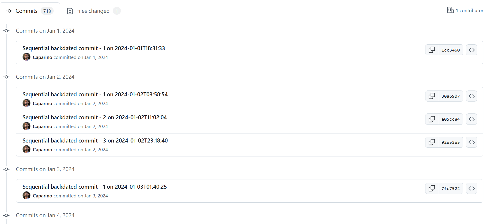

# git commit automation for $500k/yr jobs

A Python script that creates 1-3 commits daily, at random times of the day, from a specified start date to today. This is perfect for generating a realistic Git history or simulating daily contributions for a GitHub streak.

Inspired by [@Shogun89's fancy_job](https://github.com/Shogun89/fancy_job)

## Features

- Automatically generates backdated commits from a specified start date to today, default start date is Jan 1st, 2024.
- Ensures 1-3 commits per day with sequential timestamps to maintain a clean Git history.
- Modifies a file (`changes.txt`) to include unique changes for each commit.
- Commits include timestamps set using `GIT_AUTHOR_DATE` and `GIT_COMMITTER_DATE`.

## Setup

1. Clone this repository:

```bash
git clone https://github.com/Caparino/git_committed
cd git_committed
```

2. Run the script to generate commits:

```bash
python git_committed.py
```

3. Add and push to your own repo since forks don't count for contributions:
```bash
git remote -v

git remote remove <remote-name>
#eg. git remote remove https://github.com/Caparino/git_committed.git

git remote add <remote-name> <remote-url>
#eg. git remote add https://github.com/your_account/git_committed.git

git push -u origin main
```

## Usage

The script will create 1-3 commits a day at random times for every day from your start_date (Jan 1, 2024 by default) to today.

You can modify the script to use any start date, any range of random commits per day, or use a different file to store the number.

By running this you will be able get a fancy streak on your github profile and get a job.


## Here's what it looks like in action

